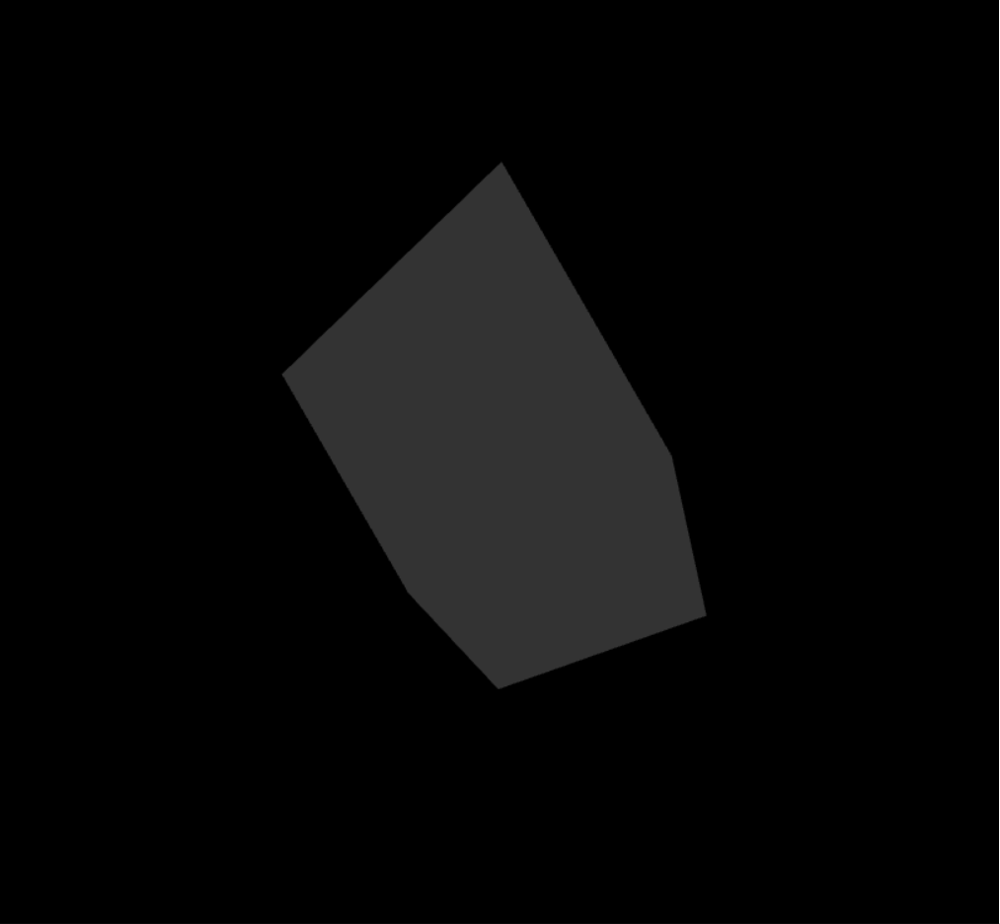
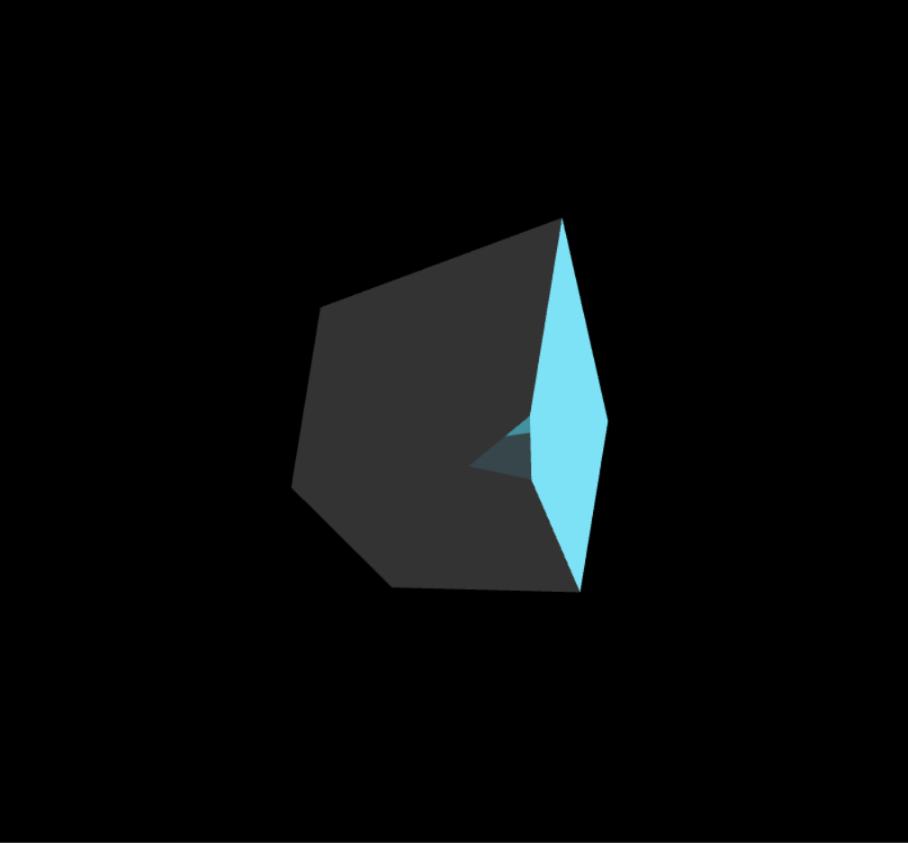

# Report: CS405 Project 1 - 3D Animations using ChatGPT

## Project Overview
In this project, I implemented a transformation and animation process for a 3D cube object using WebGL. The goal was to calculate a `modelViewMatrix` through ChatGPT for a cube, replicate this matrix manually by using the functions provided by the project, and then create an animation for the cube's movement between its initial and transformed states. The animation, as it was done with the first task, was also created with the help of ChatGPT, which provided the code. The project is divided into three tasks.

## Task 1: Using ChatGPT for ModelView Matrix Calculation
For the first task, I provided ChatGPT with the `transformation-prompt.txt`. From that prompt, ChatGPT generated a `modelViewMatrix` in the form of a `Float32Array`. The output matrix represents the combined transformations (translation, rotation, and scaling) applied to the cube. I then placed the output into the `getChatGPTModelViewMatrix()` function inside `utils.js`. The result was verified by rendering the cube and capturing a screenshot of the generated view:

The links for both of the chats with ChatGPT are provided at the end of this report in the references.

## Task 2: Manual ModelView Matrix Calculation
In this task, I used the given functions in the project to manually create the render. For translation, rotation (X, Y, Z), and scaling, the transformations requested in `transformation-prompt.txt` were applied. The functions were used inside the `getModelViewMatrix()` function. Each transformation was applied sequentially, and the resulting matrix was compared to the one generated by ChatGPT.

### Transformation Parameters:
- **Translation**: (0.3, -0.25, 0)
- **Rotation**:
  - X-axis: 30 degrees
  - Y-axis: 45 degrees
  - Z-axis: 60 degrees
- **Scale**: (0.5, 0.5, 1)

Similarly to Task 1, the result was verified by rendering the cube and capturing a screenshot of the generated view:

### Matrix Comparison
The manually calculated matrix was compared to the matrix generated by ChatGPT, and the differences were apparent. The outputs varied significantly between the two methods. This discrepancy might be attributed to a few factors:

- The sequence in which transformations (translation, scaling, and rotation) are applied can affect the final `modelViewMatrix`. The order of operations in matrix multiplication changes the output of the calculation even if the same matrices are used in different orders. As such, ChatGPT may have used a different order of operations compared to the manual implementation.
- ChatGPT is a large language model (LLM) designed to understand and generate text-based solutions. While it can produce code and perform calculations, its approach differs from traditional algorithmic methods since it is a probabilistic artificial intelligence that uses predictions of words instead of calculations. Hence, ChatGPT may not provide the correct answer when asked, especially if it is prompted for an answer with minimal detail.

These variations in the transformation matrices resulted in visibly different outputs, as seen in the screenshots: `cs405_project_chatGPT_image.png` (using ChatGPT’s matrix) and `cs405_project_image.png` (using the manually calculated matrix).

## Task 3: Animating the Cube
For the third task, I asked ChatGPT to animate the transformation calculated in Task 2. The animation involves a continuous loop with a 10-second cycle:
- In the first 5 seconds, the cube transitions from its initial identity matrix state to the transformed state.
- In the last 5 seconds, the cube returns from the transformed state back to its initial position.

This was implemented in the `getPeriodicMovement()` method, using time-based interpolation between the identity matrix and the target transformation matrix, where matrix A was blended based on the time passed over 10 seconds as a percentage, while matrix B was blended by (1 – percentage time passage).

## Conclusion
ChatGPT served as a helpful tool for initial matrix calculations and animation logic, while the manual implementation provided a solid grasp of the underlying mathematical concepts. The final result is an animated cube that transforms and resets its position in a smooth, continuous loop over 10 seconds.

## References
- Task 1: [ChatGPT Conversation 1](https://chatgpt.com/share/670d38d9-d56c-8005-803c-96bea9180293)
- Task 3: [ChatGPT Conversation 2](https://chatgpt.com/share/670f7d2d-8b50-8005-a006-53cfb0b9c419)
